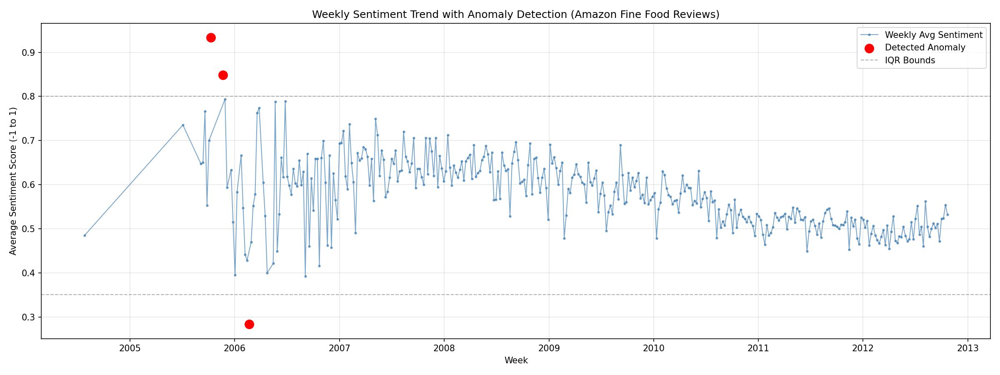

# Sentiment Analysis & Anomaly Detection Pipeline

End-to-end NLP pipeline that fine-tunes DistilBERT for sentiment classification on Amazon product reviews, with weekly trend analysis and statistical anomaly detection.

## Project Overview

This project extends a previous serverless ETL pipeline (Java/AWS Lambda/Supabase/React) by adding a full NLP model training and inference layer. It demonstrates:

- Fine-tuning a transformer model (DistilBERT) for 3-class sentiment classification
- Handling class imbalance via undersampling
- Time-series anomaly detection on sentiment trends, including root-cause validation
- (Planned) Model serving via AWS Lambda and a React dashboard

## Dataset

[Amazon Fine Food Reviews](https://www.kaggle.com/datasets/snap/amazon-fine-food-reviews) (CC0-1.0 license), 568,454 reviews spanning 1999-2012.

To download:
```bash
kaggle datasets download -d snap/amazon-fine-food-reviews
unzip amazon-fine-food-reviews.zip
```

## Methodology

### Sentiment Classification

1. **Label creation**: Star ratings mapped to sentiment classes (1-2: negative, 3: neutral, 4-5: positive)
2. **Class balancing**: Undersampled to 40,000 examples per class (120,000 total) to address the original 64% positive-class skew
3. **Fine-tuning**: DistilBERT (`distilbert-base-uncased`), 3 epochs, max sequence length 128 (selected based on the 95th percentile token length of 134)
4. **Evaluation**: Best checkpoint selected via validation F1 score

### Anomaly Detection

1. **Full-corpus inference**: Ran the fine-tuned model over all 568,454 reviews (not just the balanced subset) to preserve the true temporal distribution
2. **Data quality check**: Discovered 30.76% duplicate reviews (174,875 rows) — likely from users copying the same review across product variants
3. **Weekly aggregation**: Grouped sentiment scores by week, filtering out weeks with fewer than 30 reviews to avoid noisy averages from sparse early data
4. **IQR-based anomaly detection**: Flagged weeks where average sentiment fell outside [Q1 - 1.5×IQR, Q3 + 1.5×IQR]
5. **Root-cause validation**: Investigated the most extreme anomaly (pre-deduplication) and found it was driven by triplicate copies of an unrelated, non-sentiment question ("Are you supposed to avoid sugars if you have a urinary tract infection?") misclassified as negative — not a genuine sentiment shift

## Results

### Sentiment Classification (Test Set)

| Metric | Score |
|---|---|
| Accuracy | 84% |
| F1 (weighted) | 84% |

Per-class breakdown showed the "neutral" class as the primary source of confusion (F1: 0.78 vs 0.84-0.88 for negative/positive), consistent with the inherent ambiguity of neutral sentiment expression in natural language.

### Anomaly Detection

- Before deduplication: 8 anomalous weeks detected out of 527 (1.5%)
- After deduplication: 3 anomalous weeks detected out of 365 weeks meeting the minimum volume threshold (0.8%)
- The deduplication step eliminated the most extreme false-positive anomaly, confirming the value of data quality checks before trusting automated anomaly flags



*Note: pre-2006 data is sparse (visible as gaps between data points), so early-period trends should be interpreted with caution. The analysis is most statistically robust from 2006 onward.*

## Tech Stack

- **ML**: PyTorch, Hugging Face Transformers, scikit-learn
- **Data analysis**: pandas, NumPy, Matplotlib
- **Experiment tracking**: MLflow
- **Infra (planned)**: AWS Lambda, Supabase (PostgreSQL), React/Recharts

## Project Status

- [x] Data acquisition and preprocessing
- [x] Model fine-tuning and evaluation
- [x] Weekly sentiment trend analysis
- [x] Statistical anomaly detection (IQR-based) with root-cause validation
- [ ] Model serving (AWS Lambda)
- [ ] Interactive dashboard (React/Recharts)

## Author

[GitHub - WErenJaeger](https://github.com/WErenJaeger)
